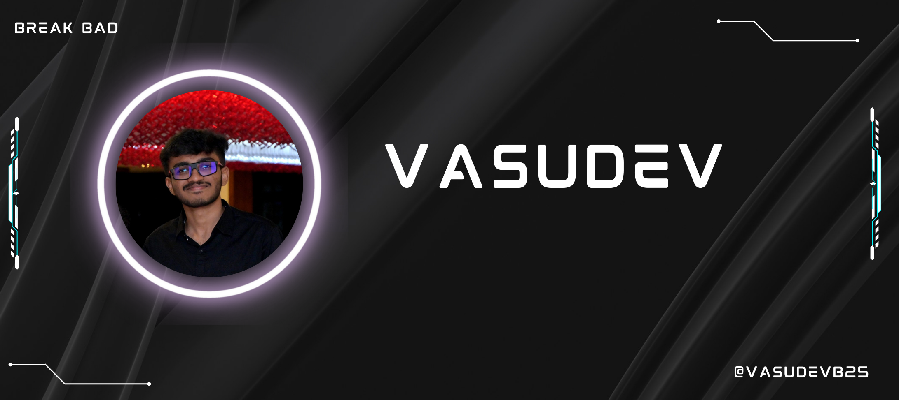

# 💫 Hello there!:
I am Vasudev, a Cybersecurity enthusiast and Blockchain developer with a strong foundation in ethical hacking, blockchain, and digital security.  Currently pursuing a BTech at Amrita School of Engineering, I am an active member of the ACM Student Chapter, contributing to research and development in cybersecurity.   Passionate about securing digital ecosystems, I specialize in vulnerability assessment, network security, and cryptography.  Constantly exploring new technologies, I aim to build secure and scalable solutions that enhance online safety and efficiency.

  

## 🌐 Socials:
  

# 💻 Tech Stack:
                                   
# 📊 GitHub Stats:
 
 

## 🏆 GitHub Trophies

### ✍️ Random Dev Quote

       

### 🔝 Top Contributed Repo

---

<!-- Proudly created with GPRM ( https://gprm.itsvg.in ) -->
